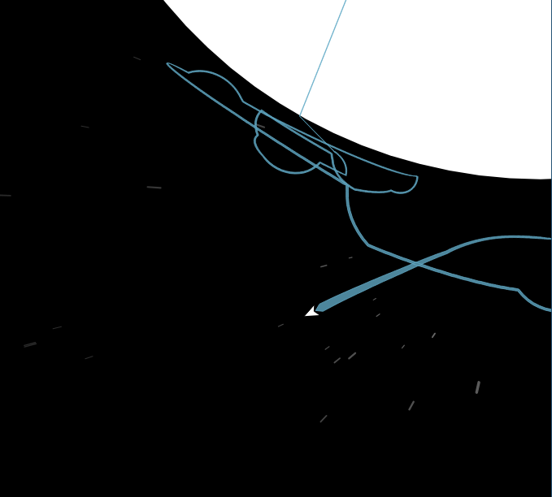
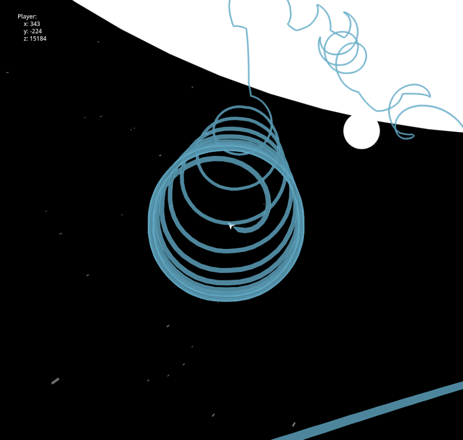
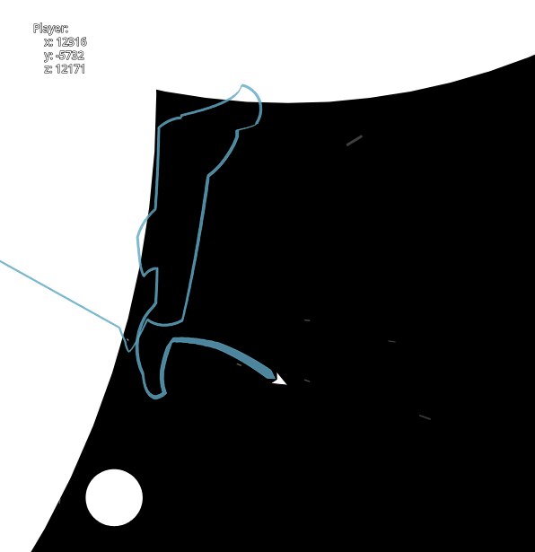
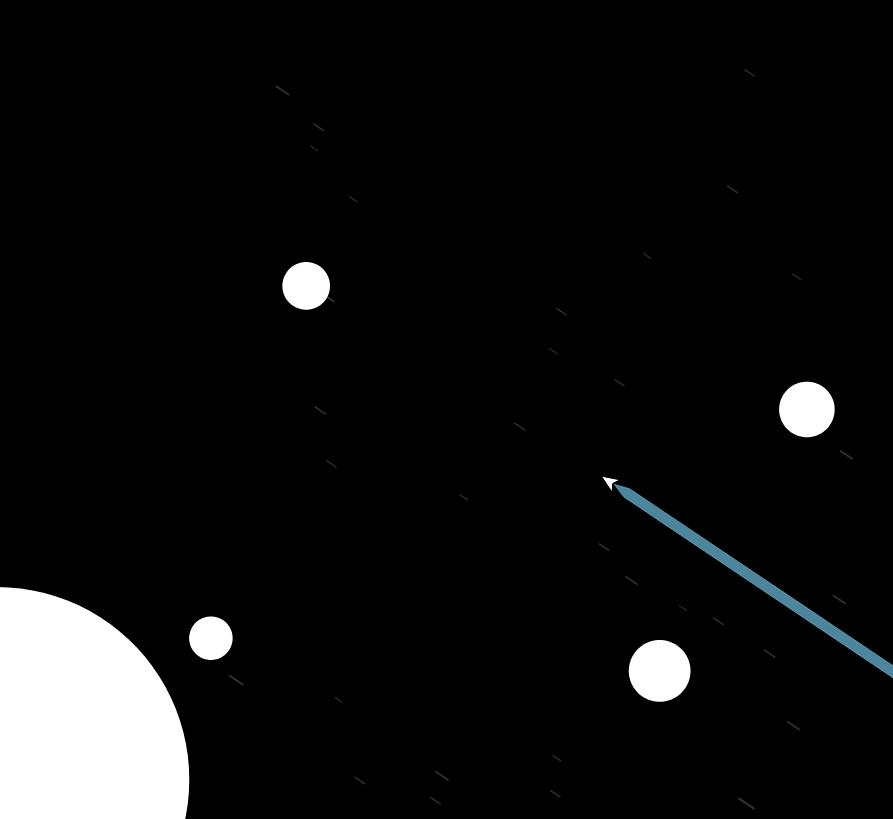

# Spaaaace Game Demo

This demo, written using p5.js and JavaScript, demonstrates a top-down pseudo-3D space traveling game, and how one might create a 2D-like space game while also being able to see distant planetary bodies with a static camera, by implementing a Z-axis that is controlled by the player's distance from planets, allowing them to see multiple destinations of travel without the need for a map.

## Origins
Originally, the classic version of this demo was made years ago on [Khan Academy's](https://www.khanacademy.org/) ProcessingJS editor. The editor which can be found [here](https://www.khanacademy.org/computer-programming/new/pjs). but as the project started to increase in scope, the need for file organization arose, and I eventually transitioned the project to p5.js, and GitHub Pages.

## Play the Demo

#### Controls
`w` or `<up>` to thrust \
`a` or `<left>` to turn counterclockwise \
`d` or `<right>` to turn clockwise

[Link to the demo](https://stephen010x.github.io/spaaaace)

[Link to the old demo](https://stephen010x.github.io/spaaaace/old-demo)

## Screenshots

